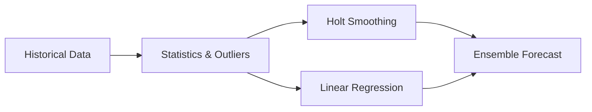

# Finance Forecast Engine

A zero-dependency TypeScript library for cash-flow forecasting, debt payoff projection, and statistical analysis.

## Features

- **Forecasting:** Holt-Winters smoothing, Linear Regression, and an Adaptive Ensemble model.
- **Outlier Detection:** IQR-based anomaly removal for robust financial projections.
- **Debt Amortization:** Avalanche and Snowball payoff strategies, schedule generation.
- **Statistics:** Weighted averages, standard deviation, and seasonal indices.

## Installation

```bash
npm install finance-forecast-engine
```

## Quick Start

```typescript
import { ensembleForecast, calculatePayoffPlan } from "finance-forecast-engine";

// 1. Forecast expenses
const pastExpenses = [2100, 2050, 2200, 2150, 2300, 2250];
const nextMonth = ensembleForecast(pastExpenses);
console.log(`Next month forecast: $${nextMonth.toFixed(2)}`);

// 2. Plan Debt Payoff
const debts = [
  { id: "1", name: "Credit Card", balance: 5000, interestRate: 22, minimumPayment: 150 },
  { id: "2", name: "Car Loan", balance: 15000, interestRate: 5, minimumPayment: 300 }
];
const plan = calculatePayoffPlan(debts, 500, "avalanche");
console.log(`Debt free by: ${plan.overallPayoffDate}`);
console.log(`Total interest saved vs minimum payments: calculated inside!`);
```

## Architecture



## License
MIT

